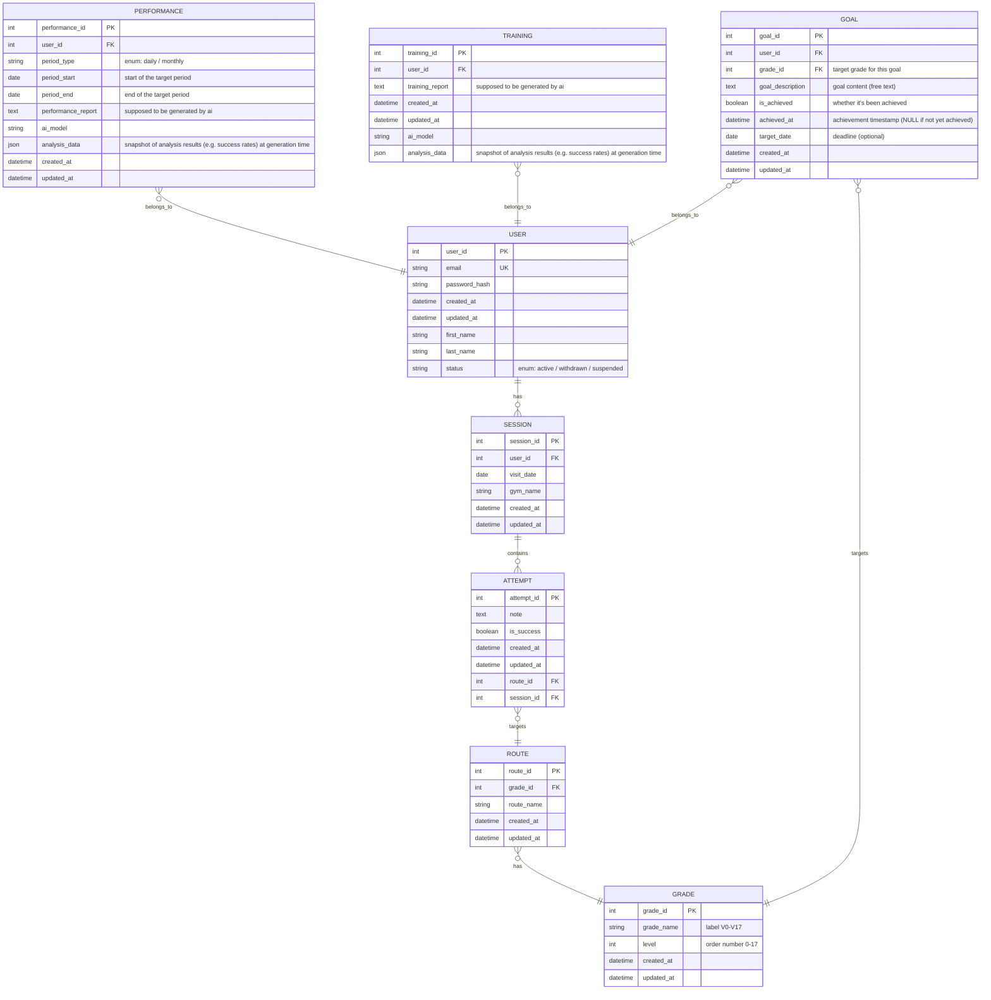

```mermaid
erDiagram
    USER ||--o{ SESSION : has
    SESSION ||--o{ ATTEMPT : contains
    ATTEMPT }o--|| ROUTE : targets
    ROUTE }o--|| GRADE : has
    PERFORMANCE }o--|| USER : belongs_to
    TRAINING }o--|| USER : belongs_to
    GOAL }o--|| USER : belongs_to
    GOAL }o--|| GRADE : targets

    USER {
        int user_id PK
        string email UK
        string password_hash
        datetime created_at
        datetime updated_at
        string first_name
        string last_name
        string status "enum: active / withdrawn / suspended"
    }

    SESSION {
        int session_id PK
        int user_id FK
        date visit_date
        string gym_name
        datetime created_at
        datetime updated_at
    }

    ATTEMPT {
        int attempt_id PK
        text note
        boolean is_success
        datetime created_at
        datetime updated_at
        int route_id FK
        int session_id FK
    }

    ROUTE {
        int route_id PK
        int grade_id FK
        string route_name
        datetime created_at
        datetime updated_at
    }

    GRADE {
        int grade_id PK
        string grade_name "label V0-V17"
        int level "order number 0-17"
        datetime created_at
        datetime updated_at
    }

    PERFORMANCE {
        int performance_id PK
        int user_id FK
        string period_type "enum: daily / monthly"
        date period_start "start of the target period"
        date period_end "end of the target period"
        text performance_report "supposed to be generated by ai"
        string ai_model
        json analysis_data "snapshot of analysis results (e.g. success rates) at generation time"
        datetime created_at
        datetime updated_at
    }

    TRAINING {
        int training_id PK
        int user_id FK
        text training_report "supposed to be generated by ai"
        datetime created_at
        datetime updated_at
        string ai_model
        json analysis_data "snapshot of analysis results (e.g. success rates) at generation time"
    }

    GOAL {
        int goal_id PK
        int user_id FK
        int grade_id FK "target grade for this goal"
        text goal_description "goal content (free text)"
        boolean is_achieved "whether it's been achieved"
        datetime achieved_at "achievement timestamp (NULL if not yet achieved)"
        date target_date "deadline (optional)"
        datetime created_at
        datetime updated_at
    }
```
