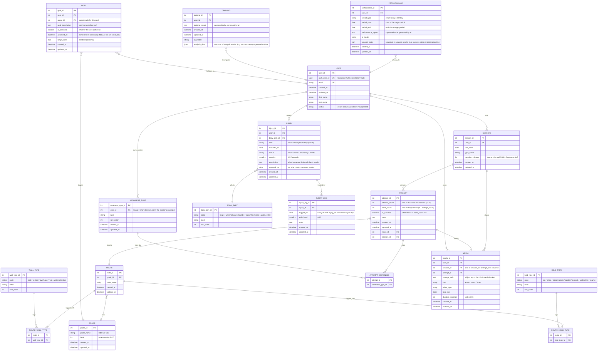

## Notes on the model

**An ATTEMPT row is one route, not one try.** `attempt_count` records how many
times a route was pulled on during a session and `send_count` how many of those
topped out, so working a project eight times before it goes is one row with an
8. `is_success` is a generated column (`send_count > 0`), which is what let the
change land without rewriting every query that already filtered on it. It also
makes two figures expressible that the old model could not hold at all: the
flash rate (`attempt_count = 1 AND send_count = 1`) and average tries-to-send.

**Three many-to-many relationships, three join tables.** Wall angles and hold
types describe the ROUTE — they are properties of the problem, not of the
climber's day — so they hang off ROUTE. Weaknesses describe the ATTEMPT: they
are the climber's read on why *that session* went the way it did. Master tables
rather than text columns because the question they exist to answer is an
aggregate one ("success rate on overhang vs slab at V4"), which is one
`GROUP BY` against a join table and an unbounded string-matching mess against
free text.

**WEAKNESS_TYPE holds two kinds of row.** `user_id IS NULL` is a shared preset;
a set `user_id` is a label that climber typed in themselves. A typed word is
promoted to a row on save, so it is a dropdown option next time — free text for
the climber, structured data for the aggregates.

**MEDIA stores no bytes.** The file lives in Supabase Storage and is uploaded
by the browser directly with the climber's own token; this table holds the
object key, and the API server never handles a file body.

**INJURY carries no diagnosis and no treatment.** The app records injuries and
manages load — an unhealed injury is an input to training-plan generation so
the plan routes around the affected body part. Storing a diagnosis or a rehab
protocol would be medical advice, which this project is not in a position to
give.
